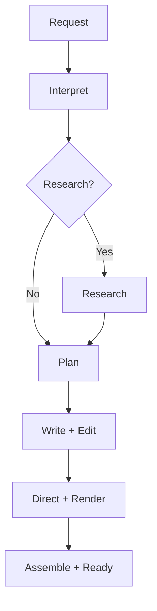

# Technical Architecture

## 1. System shape

Use a modular TypeScript monorepo so a solo developer can run, test, and refactor the full system while web traffic and media work deploy independently.

```text
apps/
  web/                 Next.js UI, auth, APIs, SSE status
  worker/              durable jobs, model calls, FFmpeg, schedules
packages/
  domain/              entities, invariants, state machine, policies
  contracts/           Zod schemas and versioned stage contracts
  application/         use cases and ports; no framework SDKs
  db/                  Prisma schema, repositories, migrations
  ai/                  prompt registry and OpenAI adapters
  audio/               chunking, rendering port, assembly, probing
  storage/             object-store ports/adapters
  queue/               job-queue ports/adapters
  observability/       logging, tracing, metrics, redaction
  ui/                  shared components and tokens
  config/              typed environment loading
  testkit/             factories, fixtures, fake providers
```

Use pnpm workspaces and Turborepo tasks. Enable TypeScript strict mode, ESLint, formatting, Vitest, Playwright, dependency auditing, and a CI pipeline.

## 2. Dependency rule

Dependencies point inward:

`UI/adapters → application use cases → domain/contracts`

The domain cannot import Next.js, Prisma, OpenAI, FFmpeg process wrappers, queue libraries, object-storage SDKs, telemetry vendors, or environment variables.

## 3. Deployable processes

### Web

- renders server and client UI;
- authenticates users;
- validates commands;
- performs ownership checks;
- creates drafts and queues jobs;
- exposes episode/library APIs;
- streams status events;
- creates short-lived signed playback URLs;
- never performs long model or FFmpeg work in an HTTP request.

### Worker

- leases jobs from PostgreSQL;
- advances generation stages;
- calls model, research, speech, storage, and media adapters;
- heartbeats leases and handles cooperative cancellation;
- writes durable stage attempts and usage;
- resumes from checkpoints;
- runs due recurring programs later.

## 4. Core ports

```ts
interface TextGenerator {
  generateStructured<I, O>(request: StructuredGeneration<I, O>): Promise<GenerationResult<O>>
}

interface ResearchProvider {
  research(request: ResearchRequest): Promise<ResearchResult>
}

interface SpeechRenderer {
  render(request: SpeechRenderRequest): Promise<RenderedChunk>
}

interface AudioAssembler {
  assemble(manifest: RenderManifest): Promise<AssembledEpisode>
}

interface ObjectStore {
  put(input: PutObject): Promise<StoredObject>
  signRead(key: string, ttlSeconds: number): Promise<string>
  deleteMany(keys: string[]): Promise<void>
}

interface JobQueue {
  enqueue(command: JobCommand): Promise<JobRef>
  lease(workerId: string): Promise<LeasedJob | null>
  heartbeat(jobId: string, leaseToken: string): Promise<void>
  complete(jobId: string, leaseToken: string): Promise<void>
  fail(jobId: string, leaseToken: string, failure: JobFailure): Promise<void>
}
```

Adapters implement these interfaces. Tests normally use deterministic fakes.

## 5. Workflow and checkpoints

One parent generation job executes a deterministic state machine. Each stage writes an immutable `StageAttempt` plus a pointer to its accepted output version. A stage may start only if prerequisites are accepted and cancellation/budget checks pass.



The stage input hash includes canonical input JSON, prompt version, schema version, model alias/config, and relevant upstream output IDs. If a completed accepted stage has the same hash, reuse it. A changed upstream artifact invalidates only descendants.

## 6. Structured AI contracts

All model stages return strict, versioned schemas and are parsed at the adapter boundary.

### ContentBrief v1

- normalized title/topic;
- user goal;
- assumed knowledge and audience;
- format, tone, depth, target minutes, WPM;
- must-answer questions;
- focus, exclusions, inclusions;
- research decision recommendation and reason;
- sensitivity/currentness flags;
- success criteria.

### EpisodePlan v1

- working title and promise;
- hook;
- ordered sections containing purpose, target seconds, key points, source claim IDs, transitions, and chapter label;
- recap/quiz strategy;
- total expected words and seconds.

### ResearchPacket v1

- query plan and `asOf`;
- source records;
- evidence records with source IDs;
- normalized claims with supporting/conflicting evidence IDs;
- uncertainties and missing information;
- safe-to-use summary.

### AudioScript v1

- title, description, disclosure;
- ordered semantic segments with stable IDs, section ID, speaker ID, spoken text, pronunciation hints, pause intent, source claim IDs, and expected seconds;
- chapter boundaries;
- final recap and optional quiz payload.

### EditorialReview v1

- dimension scores;
- fatal/blocking/non-blocking findings;
- unsupported claim references;
- runtime analysis;
- revised script;
- render approval and reason.

### VoicePlan v1

- production mode;
- speaker profiles and voice aliases;
- global delivery direction;
- per-segment direction overrides;
- pronunciation dictionary;
- pause policy.

Schemas disallow unknown properties where supported. Domain validation additionally checks IDs, totals, references, allowed values, word budgets, and evidence coverage.

## 7. Prompt registry

Prompts live in source control, one directory per stage and version:

```text
packages/ai/src/prompts/
  intent/v1.ts
  planner/v1.ts
  writer/v1.ts
  editor/v1.ts
  voice-director/v1.ts
  research-synthesizer/v1.ts
```

Each prompt module exports metadata, instructions, schema version, fixture cases, and a build function. Store the prompt ID/version and model configuration with every attempt. Never concatenate arbitrary researched text into developer instructions; source text is clearly delimited as untrusted data.

## 8. OpenAI adapters

Default architecture, verified against official documentation when this pack was written:

- Use the Responses API for direct text/research tasks.
- Use Structured Outputs rather than JSON mode for stage contracts.
- Use the Responses API `web_search` tool in the research phase.
- Use the Audio API speech endpoint for durable narration; configure a current speech model and voice aliases.
- Keep Realtime separate for future interactive episode Q&A.

Official references:

- [Text to speech](https://developers.openai.com/api/docs/guides/text-to-speech)
- [Create speech reference](https://developers.openai.com/api/reference/resources/audio/subresources/speech/methods/create)
- [Structured Outputs](https://developers.openai.com/api/docs/guides/structured-outputs)
- [Web search](https://developers.openai.com/api/docs/guides/tools-web-search)
- [Realtime and audio](https://developers.openai.com/api/docs/guides/realtime)

Provider limits and model names live in typed configuration. The speech adapter exposes its maximum input characters; the chunker uses a lower safety threshold and never splits inside a semantic segment unless an oversized segment is first rewritten.

## 9. Audio rendering and assembly

1. Convert approved script segments plus voice plan into ordered `RenderUnit`s. In MVP, one semantic transcript segment maps to one render unit so its actual duration is known.
2. A future optimizer may group adjacent compatible segments only if an alignment adapter can recover reliable per-segment timestamps. Grouping must never trade away synchronized transcript correctness.
3. Compute a render hash from exact spoken text, voice alias/provider voice, instructions, speed, format, and adapter version.
4. Reuse an existing successful chunk with the same hash.
5. Render to lossless WAV or PCM for assembly. Persist provider metadata, checksum, byte count, and attempt.
6. Validate decodability, non-zero duration, expected-duration bounds, sample rate, channels, and silence thresholds.
7. Normalize loudness conservatively, insert planned silence, concatenate in manifest order, and encode final MP3/AAC plus optional HLS later.
8. Run FFprobe on the final file. Derive transcript timing from each render unit’s actual probed duration and chapter timing from cumulative segment boundaries.
9. Generate waveform peaks and metadata.
10. Upload artifacts, then atomically mark `ready`.

Never concatenate arbitrary MP3 bytes. Never make an episode ready before the database points to all required durable objects.

## 10. Data model

Primary tables/entities:

- `User`, `Account`, `Session`
- `UserPreference`, `TopicKnowledge`, `PreferenceEvidence`
- `CreationRequest`
- `Episode`, `EpisodeLineage`, `EpisodeProgress`
- `ContentBriefVersion`, `ResearchPacketVersion`, `EpisodePlanVersion`, `ScriptVersion`, `VoicePlanVersion`
- `Source`, `Evidence`, `Claim`, `ClaimEvidence`
- `GenerationJob`, `StageAttempt`, `ProviderCall`, `UsageLedger`
- `RenderManifest`, `RenderChunk`, `MediaAsset`
- `Chapter`, `TranscriptSegment`, `PlaybackProgress`
- `Playlist`, `PlaylistEpisode`
- `Series`, `SeriesEpisode`, `LearningContext`, `QuizAttempt`
- `Program`, `ProgramRun`, `ContentFingerprint`
- `Feedback`, `DeletionRequest`, `AuditEvent`

Every owned row has a user or ownership path. Versioned generation artifacts are immutable after acceptance. Soft-delete user-facing metadata only while background object deletion is pending; privacy deletion must eventually hard-delete or irreversibly anonymize according to policy.

## 11. HTTP/application API

Prefer typed route handlers with a generated client contract.

```text
POST   /api/creation-requests
PATCH  /api/creation-requests/:id
POST   /api/episodes
GET    /api/episodes
GET    /api/episodes/:id
POST   /api/episodes/:id/cancel
POST   /api/episodes/:id/retry
DELETE /api/episodes/:id
GET    /api/episodes/:id/events
GET    /api/episodes/:id/playback-url
PUT    /api/episodes/:id/progress
POST   /api/episodes/:id/follow-ups
POST   /api/episodes/:id/questions
GET    /api/episodes/:id/sources
POST   /api/playlists
POST   /api/series
POST   /api/programs
```

Commands accept idempotency keys. Responses never expose provider secrets, raw internal prompts, chain-of-thought, private object keys, or other users’ IDs.

## 12. Database queue behavior

Use a library or small adapter implementing PostgreSQL leases with `FOR UPDATE SKIP LOCKED` semantics. Required properties:

- enqueue transaction can commit with episode creation;
- unique idempotency key;
- `available_at`, priority, attempt count, max attempts;
- lease owner/token and expiry;
- heartbeat;
- exponential backoff with jitter;
- dead-letter/permanent failure state;
- cooperative cancellation check between calls/chunks;
- stale lease recovery;
- per-user concurrency and global provider concurrency.

No job may rely only on in-memory state.

## 13. Security boundaries

- Browser never receives `OPENAI_API_KEY`, storage credentials, database credentials, queue leases, or raw provider response bodies.
- Route handler authenticates first, validates second, authorizes ownership third, then invokes a use case.
- Signed playback URLs use short TTLs and an allowlisted key owned by the episode.
- Research source content is untrusted. It cannot supply system instructions, tool definitions, secrets, or destination URLs for server requests.
- Server-side fetching uses allow/deny controls against local/private networks and limits redirects, size, and content types.
- Sensitive logging uses explicit allowlists rather than “log then redact.”
- Usage reservations prevent parallel jobs from bypassing a user budget.

## 14. Observability

Every request/job/stage/provider call carries correlation IDs. Capture:

- stage latency and result;
- queue delay and lease recovery;
- model/tool/speech usage and estimated/actual cost;
- schema validation failures;
- chunk render attempts and reuse;
- final audio duration/size;
- user cancellation and retry;
- playback errors and URL refreshes.

Traces may contain artifact IDs and prompt versions, not full private content by default. Provide an owner-only job inspector in development/admin mode.

## 15. Testing strategy

- **Unit:** domain invariants, state transitions, runtime math, chunking, research rules, budget and dedupe logic.
- **Contract:** every schema, prompt fixture, provider adapter parser, storage and queue port behavior.
- **Integration:** PostgreSQL repositories/queue, filesystem/S3 storage, FFmpeg assembly with generated tones, route authorization.
- **End-to-end:** create → status → ready → play → seek → persist progress → delete, with deterministic fake providers.
- **Provider smoke:** opt-in, budget-capped real OpenAI calls; never part of every local test.
- **Evals:** golden prompt set graded by deterministic checks, evidence rules, and rubric-based model judges with pinned versions.
- **Accessibility:** automated axe checks plus keyboard/screen-reader manual checklist.

## 16. CI gates

On every pull request:

1. install with frozen lockfile;
2. formatting/lint;
3. strict typecheck;
4. unit and contract tests;
5. integration tests with PostgreSQL;
6. production web and worker builds;
7. migration validation;
8. dependency and secret scanning;
9. targeted Playwright smoke tests;
10. changed prompt/schema eval fixtures.

Full provider evals and long audio tests run manually or on a budgeted schedule.

## 17. Local development

Docker Compose supplies PostgreSQL and an optional S3-compatible emulator. The application supplies deterministic fake model and speech adapters so a contributor can exercise the entire product without spending API credits. A separately enabled smoke profile uses real provider calls.

## 18. Scaling path

- Scale web and worker independently.
- Partition worker concurrency by generation vs rendering work.
- Add a hosted workflow engine only when database queue operational load justifies it.
- Add CDN/HLS when playback geography and file size justify it.
- Cache only by privacy-safe content hash within an owner boundary unless policy explicitly permits broader reuse.
- Preserve contracts so mobile clients and alternative providers can be added without changing domain concepts.
